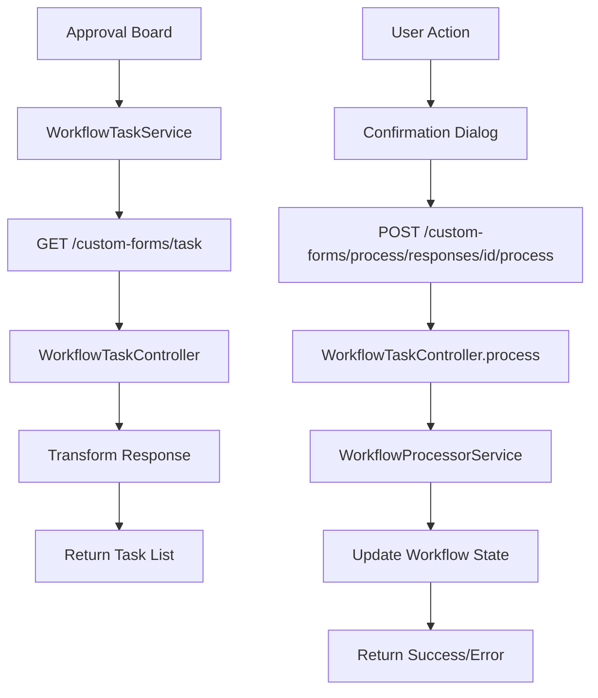

# Approval Board System

A comprehensive workflow approval system built with Angular frontend and Laravel backend, designed to handle form submissions through customizable approval workflows.

## 🎯 Overview

The Approval Board system provides a streamlined interface for approving or rejecting workflow tasks with the following key features:

- **Multiple View Modes**: List and Grid view for different user preferences
- **Real-time Updates**: Tasks are removed from the board after processing
- **Interactive Approvals**: Approve/reject with optional notes and comments
- **Advanced Filtering**: Filter by process type and search functionality
- **Assignee Management**: Display multiple assignees (users/groups) with avatar support
- **Adaptive Form Display**: Dynamic form data rendering with field type detection

## 🏗️ Architecture

### Frontend Components (Angular)

```
src/app/features/tickets/
├── pages/approval-board/
│   ├── approval-board.component.ts     # Main approval board container
│   ├── approval-board.component.html   # Board layout and controls
│   └── approval-board.component.css    # Styling
├── components/
│   ├── approval-list-view/             # List view component
│   ├── approval-grid-view/             # Grid view component
│   ├── ticket-detail-content/          # Shared detail component
│   └── confirmation-dialog/            # Approval/rejection dialog
├── services/
│   └── workflow-task.service.ts        # API integration service
└── models/
    └── ticket.interface.ts             # Type definitions
```

### Backend Controllers (Laravel)

```
app/Http/Controllers/
├── WorkflowTaskController.php          # Main task management
├── CustomFormResponseWorkflowController.php  # Process handling
└── CustomFormResponseController.php    # Form data management

app/Services/
├── WorkflowProcessorService.php        # Workflow state management
└── CFWorkflowService.php               # Core workflow operations
```

## 🔌 API Endpoints

### Task Management
- **GET** `/v1/custom-forms/task` - Get approval tasks with filtering
- **GET** `/v1/custom-forms/task/{id}` - Get specific task details

### Task Processing
- **POST** `/v1/custom-forms/process/responses/{id}/process` - Approve/reject tasks

#### Request Format
```json
{
  "action": "approve|reject",
  "notes": "Optional approval/rejection notes"
}
```

#### Response Format
```json
{
  "success": true|false,
  "message": "Processing result message",
  "stage": { "workflow_stage_data" }
}
```

## 🚀 Features

### 1. **Dual View Modes**
- **List View**: Tabular format for detailed information scanning
- **Grid View**: Card-based layout with side-by-side task details

### 2. **Advanced Filtering**
- Process type filtering (All, Bug, Feature, Task, etc.)
- Real-time search across title, description, and requestor
- Stage type filtering (approval vs kanban workflows)

### 3. **Task Processing**
- **Approve**: Move task to next workflow stage
- **Reject**: Mark task as rejected with required notes
- **Notes Support**: Optional comments for approvals, required for rejections

### 4. **Assignee Display**
Multiple display modes:
- **Compact**: Small avatars with names
- **Detailed**: Full assignee information
- **Avatar**: Avatar-only display
- **List**: Simple list format

### 5. **Adaptive Form Rendering**
Intelligent form data display with:
- Field type detection (currency, date, boolean, etc.)
- Table rendering for array data
- Currency formatting with PHP default
- Date standardization (dd/mmm/yyyy)

## 💾 Data Models

### WorkflowTask Interface
```typescript
interface WorkflowTask {
  id: string;
  title: string;
  description: string;
  status: string;
  priority: string;
  type: string;
  form_type: string;
  stage_name: string;
  created_at: string;
  updated_at: string;
  due_date?: string;
  reference_id: string;
  requestor: string;
  assignees: Array<{
    id: string;
    name: string;
    type: 'user' | 'group';
    avatar?: string;
  }>;
  form_data: any;
}
```

### Backend Response Structure
```php
[
    'id' => $task->id,
    'title' => $this->getFormTitle($task),
    'description' => $task->customFormResponse->form_data['description'] ?? '',
    'status' => $task->status,
    'priority' => $task->priority ?? 'medium',
    'type' => $task->type ?? 'approval',
    'form_type' => $task->customFormResponse->customForm->name,
    'stage_name' => $task->workflowStage->name,
    'created_at' => $task->created_at,
    'updated_at' => $task->updated_at,
    'due_date' => $task->due_date,
    'reference_id' => $task->customFormResponse->reference_id,
    'requestor' => $this->getRequestorName($task),
    'assignees' => $this->getAssigneeDetails($task),
    'form_data' => $task->customFormResponse->form_data
]
```

## 🔧 Setup & Configuration

### Frontend Setup
1. **Install Dependencies**
   ```bash
   cd /home/john/development/co-formhub-html
   npm install
   ```

2. **Environment Configuration**
   ```typescript
   // src/environments/environment.ts
   export const environment = {
     formhub: {
       url: 'http://localhost:8000/v1'
     }
   };
   ```

3. **Start Development Server**
   ```bash
   ng serve
   ```

### Backend Setup
1. **Laravel Dependencies**
   ```bash
   cd /home/john/development/form-hub-api
   composer install
   ```

2. **Database Setup**
   ```bash
   php artisan migrate
   php artisan db:seed
   ```

3. **Start API Server**
   ```bash
   php artisan serve --port=8000
   ```

## 🎨 UI Components

### Approval Board Layout
- **Header**: View toggle buttons, process type filter, search input
- **Main Content**: Dynamically switched between list/grid views
- **Loading States**: Spinner during API calls
- **Error Handling**: User-friendly error messages

### Confirmation Dialog
- **Approval Mode**: Optional notes input
- **Rejection Mode**: Required notes input with validation
- **Skip Option**: "Don't ask again" functionality

### Assignee Display
- **User Assignees**: Employee avatars and names
- **Group Assignees**: Group icons and names (FINANCE, ITD-WEBDEV, etc.)
- **Multiple Display Modes**: Compact, detailed, avatar-only, list

## 🔄 Workflow Integration

### Stage Types
- **approval**: Tasks requiring manual approval
- **kanban**: Regular workflow stages

### Workflow Processing
The system integrates with `WorkflowProcessorService` for:
- Stage transitions
- Status updates
- Notification triggers
- Audit logging

### Employee Integration
- **Requestor Identification**: Uses `created_by` user relationship
- **Employee Data**: Formatted as "uid - lastname, firstname"
- **Assignee Resolution**: Supports both individual users and groups

## 📊 Data Flow



## 🎯 Usage

### Basic Workflow
1. **View Tasks**: Navigate to approval board to see pending tasks
2. **Select Task**: Click on a task to view details
3. **Review Content**: Examine form data, attachments, and requestor info
4. **Take Action**: Approve with optional notes or reject with required notes
5. **Confirmation**: Task is processed and removed from the board

### Advanced Features
- **Bulk Actions**: Process multiple tasks (future enhancement)
- **Filtering**: Use process type and search filters
- **View Switching**: Toggle between list and grid views
- **Keyboard Navigation**: Arrow keys for task navigation (future enhancement)

## 🔍 Troubleshooting

### Common Issues
1. **API Connection**: Verify backend server is running on port 8000
2. **CORS Errors**: Check Laravel CORS configuration
3. **Authentication**: Ensure valid JWT token in localStorage
4. **Data Loading**: Check network requests in browser dev tools

### Debug Information
- **Backend Logs**: Check `storage/logs/laravel.log`
- **Frontend Console**: Monitor browser console for JavaScript errors
- **Network Tab**: Inspect API requests/responses

## 🚀 Future Enhancements

### Planned Features
- **Bulk Operations**: Select and process multiple tasks
- **Advanced Filtering**: Date ranges, assignee filtering
- **Real-time Updates**: WebSocket integration for live updates
- **Keyboard Shortcuts**: Hotkeys for common actions
- **Export Functionality**: Download task reports
- **Mobile Optimization**: Responsive design improvements

### Performance Optimizations
- **Virtual Scrolling**: Handle large task lists efficiently
- **Caching Strategy**: Implement task data caching
- **Pagination**: Server-side pagination for large datasets
- **Lazy Loading**: Load task details on demand

## 📋 Development Notes

### Code Standards
- **TypeScript**: Strict type checking enabled
- **Angular Style Guide**: Following official Angular conventions
- **Laravel PSR**: Following PSR-4 autoloading standards
- **API Design**: RESTful endpoints with consistent response format

### Testing Strategy
- **Unit Tests**: Component and service testing
- **Integration Tests**: API endpoint testing
- **E2E Tests**: Complete workflow testing
- **Performance Tests**: Load testing for large datasets

---

**Last Updated**: November 13, 2025  
**Version**: 1.0.0  
**Maintainer**: Development Team