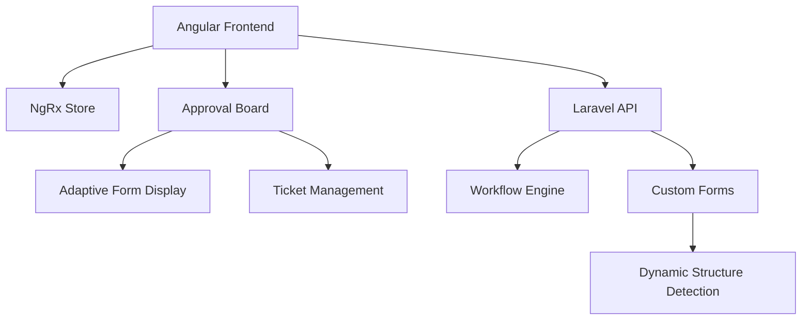

# 📚 Co-FormHub Documentation Center

Welcome to the comprehensive documentation for the Co-FormHub project. This repository contains both the Angular frontend (`co-formhub-html`) and Laravel backend API (`form-hub-api`) for the dynamic form submission and approval workflow system.

> **📋 [Master Documentation Index](./DOCUMENTATION_INDEX.md)** - Complete catalog of all documentation files

## 🚀 Quick Navigation

### 📋 **Core Documentation**
- [🎯 **Approval Board System**](./src/app/features/tickets/APPROVAL_BOARD_README.md) - Complete guide to the ticket approval workflow
- [🔄 **Adaptive Form Display**](./docs/ADAPTIVE_FORM_SYSTEM.md) - Smart form rendering that adapts to any structure
- [⚙️ **Original Angular Setup**](#original-angular-setup) - Getting started and build information

### 🛠️ **Development Guides**
- [📊 **NgRx State Management**](#ngrx-state-management) - Store architecture and patterns
- [🔌 **API Integration**](#api-integration) - Laravel backend connection guide
- [🎨 **UI Components**](#ui-components) - Reusable component library
- [🧪 **Testing Strategy**](#testing-strategy) - Unit and integration testing

### 🏗️ **System Architecture**



## 📁 **Repository Structure**

### Frontend (`co-formhub-html`)
```
src/
├── app/
│   ├── features/
│   │   ├── tickets/          # 🎫 Approval Board System
│   │   │   ├── components/   # UI Components
│   │   │   ├── services/     # API Services
│   │   │   ├── utils/        # Form Processing Utils
│   │   │   └── models/       # TypeScript Interfaces
│   │   ├── auth/             # 🔐 Authentication
│   │   └── shared/           # 🔄 Shared Components
│   ├── core/                 # 🏛️ Core Services
│   └── store/                # 🗃️ NgRx State Management
└── docs/                     # 📚 Documentation
```

## 🎯 **Key Features**

### 🎪 **Approval Board System**
- **Smart Ticket Management**: Unified interface for all approval workflows
- **Dynamic Form Rendering**: Automatically adapts to any form structure
- **Professional UI**: Clean, responsive design with proper accessibility
- **Real-time Updates**: Live status changes and notifications
- **Bulk Operations**: Handle multiple approvals efficiently

### 🔄 **Adaptive Form Display**
- **Zero Configuration**: New forms work automatically
- **Smart Field Detection**: Automatically identifies dates, currency, status fields
- **Table Generation**: Arrays become properly formatted tables
- **Currency Localization**: PHP peso (₱) formatting by default
- **Performance Optimized**: Intelligent caching and lazy loading

### ⚡ **Performance Features**
- **OnPush Change Detection**: Optimized Angular rendering
- **Intelligent Caching**: Field type and column generation caching
- **TrackBy Functions**: Efficient DOM updates for large datasets
- **Lazy Loading**: Components loaded on demand
- **Memory Management**: Proper cleanup and garbage collection

## 🛠️ **Technology Stack**

### Frontend
- **Framework**: Angular 17+ with Standalone Components
- **State Management**: NgRx Store with Effects
- **Styling**: TailwindCSS + Bootstrap hybrid
- **UI Components**: Custom component library
- **Build Tool**: Angular CLI with Webpack

### Backend
- **Framework**: Laravel 10+
- **Database**: MySQL/PostgreSQL
- **API**: RESTful with JSON responses
- **Authentication**: Laravel Sanctum
- **Workflow**: Custom workflow engine

## 📖 **Documentation Sections**

### 🎫 [Approval Board System](./src/app/features/tickets/APPROVAL_BOARD_README.md)
Complete guide covering:
- Ticket management workflow
- Approval process automation
- Status tracking and notifications
- User permissions and roles
- API integration patterns

### 🔄 [Adaptive Form System](./docs/ADAPTIVE_FORM_SYSTEM.md)
Comprehensive documentation on:
- Automatic form structure detection
- Custom form type creation
- Field type recognition and formatting
- Performance optimization techniques
- Migration guides and best practices

### 🏗️ **Architecture Documentation**

#### NgRx State Management
```typescript
// Example: Ticket State Structure
interface TicketState {
  tickets: Ticket[];
  selectedTicket: Ticket | null;
  loading: boolean;
  filters: TicketFilter;
  pagination: Pagination;
}
```

#### API Integration
```typescript
// Example: Service Integration
@Injectable()
export class TicketService {
  getTickets(filters: TicketFilter): Observable<ApiResponse<Ticket[]>> {
    return this.http.get<ApiResponse<Ticket[]>>('/api/v1/custom-forms/tasks', {
      params: this.buildFilterParams(filters)
    });
  }
}
```

### 🎨 **UI Components**

#### Adaptive Form Display
```html
<!-- Automatically renders any form structure -->
<app-adaptive-form-display [ticket]="selectedTicket"></app-adaptive-form-display>
```

#### Approval List View
```html
<!-- Professional ticket management interface -->
<app-approval-list-view 
  [tickets]="tickets$ | async"
  [selectedTicket]="selectedTicket$ | async"
  (approve)="onApprove($event)"
  (reject)="onReject($event)">
</app-approval-list-view>
```

## 🚀 **Getting Started**

### Prerequisites
```bash
# Frontend
Node.js 18+
Angular CLI 17+
npm or yarn
```

### Installation
```bash
# Clone and setup
git clone <repo> co-formhub-html
cd co-formhub-html
npm install
npm run start
```

---

## 📋 **Original Angular Setup**

This project was generated with [Angular CLI](https://github.com/angular/angular-cli) version 15.2.4.

## 📋 **Original Angular Setup**

This project was generated with [Angular CLI](https://github.com/angular/angular-cli) version 15.2.4.

### Development server

Run `ng serve` for a dev server. Navigate to `http://localhost:4200/`. The application will automatically reload if you change any of the source files.

### Code scaffolding

Run `ng generate component component-name` to generate a new component. You can also use `ng generate directive|pipe|service|class|guard|interface|enum|module`.

### Build

Run `ng build` to build the project. The build artifacts will be stored in the `dist/` directory.

### Running unit tests

Run `ng test` to execute the unit tests via [Karma](https://karma-runner.github.io).

### Running end-to-end tests

Run `ng e2e` to execute the end-to-end tests via a platform of your choice. To use this command, you need to first add a package that implements end-to-end testing capabilities.

### Further help

To get more help on the Angular CLI use `ng help` or go check out the [Angular CLI Overview and Command Reference](https://angular.io/cli) page.

---

**Last Updated**: November 13, 2025  
**Project Status**: Active Development  
**Documentation Version**: 2.0
